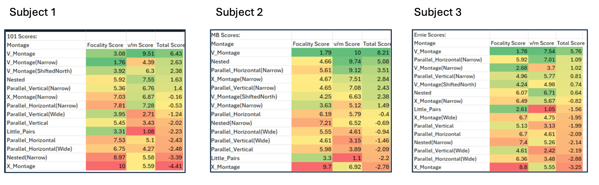

# Temporal Interference Stimulation Montage Profiling

This project analyzes temporal interference stimulation data to identify emerging trends in focality and intensity across different electrode montages.

## Project Overview
We used 13 across three subjects to examine the focality and intensity of different electrode configurations. This analysis aims to uncover trends in how various montages affect stimulation patterns.

## Project Structure
- **Data Files**: 
  - `.txt` files with focality and intensity values for each subject.
- **Scripts**:
  - Java script to pefrom noramlization and scoring
- **Output**:
  - CSV files with  results

